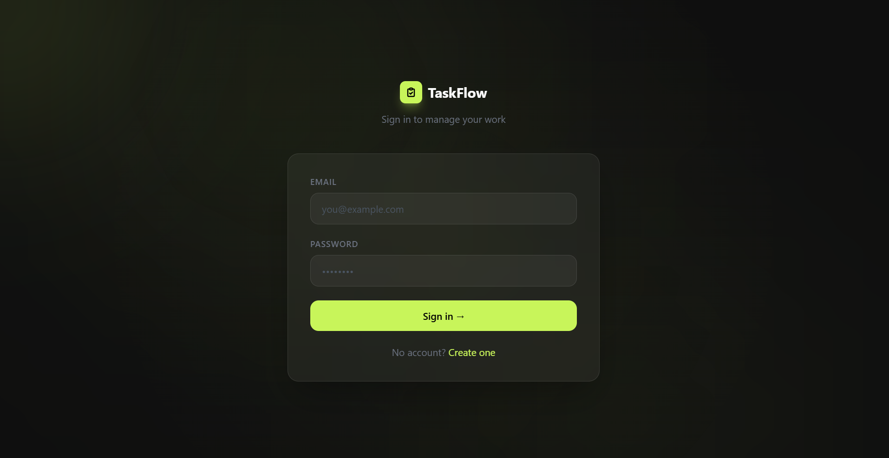
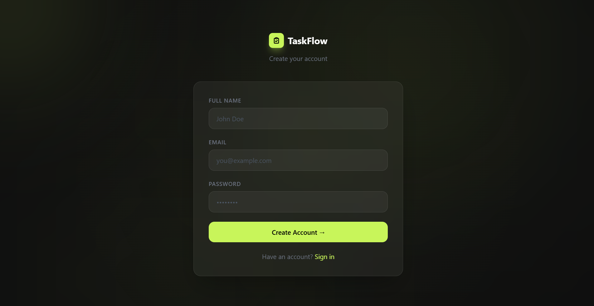
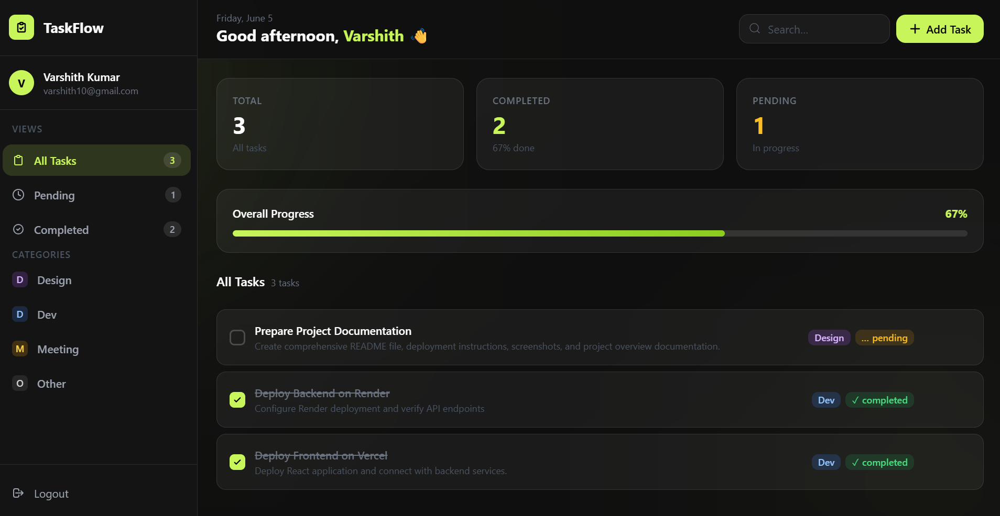
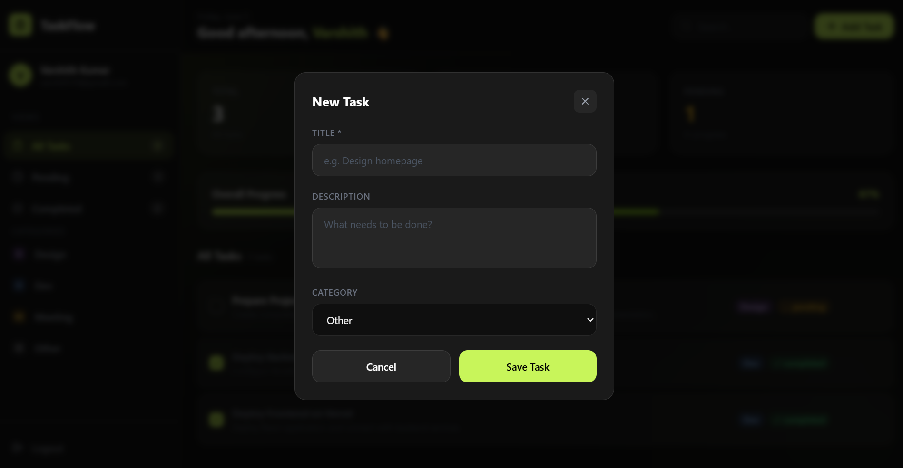

# TaskFlow - MERN Task Management Application

## Overview

TaskFlow is a full-stack task management application built using the MERN Stack (MongoDB, Express.js, React.js, Node.js).

The application allows users to register, log in securely, create tasks,edit tasks, update task status, search tasks, and manage their workflow efficiently through a clean and responsive user interface.

---

## Live Demo

Frontend (Vercel):
https://task-woad-rho.vercel.app/

Backend (Render):
https://task-backend-m8qd.onrender.com

GitHub Repository:
https://github.com/varshith1024/task

---

## Features

### Authentication
- User Registration
- User Login
- JWT Authentication
- Protected Routes
- Secure Password Hashing using bcryptjs

### Task Management
- Create Tasks
- Edit Tasks
- Update Task Status
- Delete Tasks
- Search Tasks
- Task Categories
- Task Statistics Dashboard

### User Experience
- Responsive Design
- Modern UI
- Real-Time Task Updates
- Dashboard Overview

---

## Tech Stack

### Frontend
- React.js
- Vite
- Axios
- React Router DOM
- Tailwind CSS

### Backend
- Node.js
- Express.js
- MongoDB Atlas
- Mongoose
- JWT Authentication
- bcryptjs

### Deployment
- Frontend: Vercel
- Backend: Render
- Database: MongoDB Atlas

---

## Project Structure

```text
task/
│
├── backend/
│   ├── middleware/
│   ├── models/
│   ├── routes/
│   ├── .env
│   ├── package.json
│   └── server.js
│
├── frontend/
│   ├── public/
│   ├── src/
│   │   ├── api/
│   │   ├── assets/
│   │   ├── components/
│   │   ├── context/
│   │   ├── pages/
│   │   ├── App.jsx
│   │   └── main.jsx
│   │
│   ├── .env
│   ├── package.json
|   ├── postcss.config.js
│   └── vite.config.js
│   
|   
└── README.md
```

---

## Installation & Setup

### Clone Repository

```bash
git clone https://github.com/varshith1024/task.git
cd task
```

### Backend Setup

```bash
cd backend
npm install
```

Create a .env file inside backend folder:

```env
MONGO_URI=mongodb_connection_string
JWT_SECRET=secret_key
PORT=5000
```

Run Backend:

```bash
npm start
```

---

### Frontend Setup

```bash
cd frontend
npm install
```

Create a .env file inside frontend folder:

```env
VITE_API_URL=BACKEND_URL/api
```

Run Frontend:

```bash
npm run dev
```

---

## API Endpoints

### Authentication

| Method |     Endpoint       |
|--------|--------------------|
| POST   | /api/auth/register |
| POST   | /api/auth/login    |

### Tasks

| Method   |  Endpoint      |
|----------|----------------|
| GET      | /api/tasks     |
| POST     | /api/tasks     |
| PUT      | /api/tasks/:id |
| DELETE   | /api/tasks/:id |

---

## Sample Tasks Used

### Completed

#### Deploy Frontend on Vercel
Description:
Deploy React application and connect with backend services.

#### Deploy Backend on Render
Description:
Deploy Express.js backend on Render and verify API functionality.

---

### Pending

#### Prepare Project Documentation
Description:
Create README, screenshots, deployment guide, and project documentation.

---

## Screenshots

### Login Page



### Register Page



### Dashboard



### Task Management



---

## Video Demonstration

Google Drive Link:


## Deployment

### Frontend Deployment

Platform: Vercel

Environment Variable:

```env
VITE_API_URL=BACKEND_URL/api
```

### Backend Deployment

Platform: Render

Environment Variables:

```env
MONGO_URI=mongodb_connection_string
JWT_SECRET=secret_key
```

---


## Author

K Varshith Kumar
B.Tech Student
MERN Stack Developer

Email: varshithkumar1010@gmail.com
GitHub: https://github.com/varshith1024
LinkedIn: https://www.linkedin.com/in/varshith-cse


---

## License

This project was developed as part of a MERN Stack Internship Assignment.